# 🎮 Proyecto Final SIS313: GameNet HA

> **Asignatura:** SIS313: Infraestructura, Plataformas Tecnológicas y Redes
> **Semestre:** 1/2026
> **Docente:** Ing. Marcelo Quispe Ortega

---

## 👥 Miembros del Equipo 9 - GameNet HA

| Nombre Completo | Rol en el Proyecto | Contacto GitHub |
|---|---|---|
| Arancibia Morales Shirley Celene | Capa de Datos y Monitoreo: MariaDB, Prometheus, Grafana, Fail2ban, Backups, Node.js + PM2 | [@ShirleyArancibia](https://github.com/ShirleyArancibia) |
| Arce Vargas Jose Enrique | Capa de Red y Alta Disponibilidad: Keepalived, NGINX, Balanceo de Carga, Página web del juego | [@JARTARu](https://github.com/JARTARu) | |

---

## 🎯 I. Objetivo del Proyecto

> **Objetivo:** Diseñar e implementar una infraestructura de servidor backend de alta disponibilidad para una plataforma de juegos multijugador online, integrando balanceo de carga con persistencia de sesión mediante IP hash, gestión centralizada de puntuaciones en MariaDB, monitoreo en tiempo real de jugadores y recursos del sistema a través de Prometheus y Grafana, protección activa contra intrusiones y escaneos de puertos con Fail2ban, y un sistema automatizado de respaldo horario de partidas; garantizando la continuidad del servicio ante fallos de nodo y la seguridad e integridad de los datos de juego en todo momento.

---

## 💡 II. Justificación e Importancia

> **Justificación:** En una plataforma de juegos multijugador online, la disponibilidad continua del servicio es crítica. Si el servidor principal falla, todos los jugadores conectados perderían su sesión y progreso. Este proyecto resuelve ese problema implementando Alta Disponibilidad (T3) mediante Keepalived con una IP Virtual flotante, eliminando el Single Point of Failure en la capa de balanceo. Adicionalmente, se implementa balanceo de carga con persistencia de sesión (T4) para distribuir el tráfico sin interrumpir las sesiones activas, seguridad activa con Fail2ban (T13) para proteger contra ataques automatizados, y respaldos horarios automatizados (T15) para garantizar la recuperación de datos ante cualquier fallo. El proyecto demuestra cómo una infraestructura universitaria puede alcanzar estándares de producción real con herramientas open source.

---

## 🛠️ III. Tecnologías y Conceptos Implementados

### 3.1. Tecnologías Clave

- **Keepalived:** Implementación de VRRP en esquema activo-pasivo entre VM1 y VM2. Gestiona la IP Virtual 192.168.0.200 que migra automáticamente al nodo de respaldo en caso de fallo del maestro.
- **NGINX:** Proxy inverso y balanceador de carga con algoritmo ip_hash para garantizar persistencia de sesión. Distribuye el tráfico entre VM3 (app1) y VM4 (app2).
- **Node.js + PM2:** Servidores de aplicación del juego. Node.js procesa las peticiones (registro, login, ranking, partidas). PM2 garantiza el reinicio automático y la persistencia del servicio.
- **MariaDB:** Base de datos centralizada en VM5. Almacena usuarios, partidas Snake y puntuaciones. Accesible remotamente solo desde las IPs de VM3 y VM4.
- **Prometheus + Grafana:** Monitoreo en tiempo real. Node Exporter expone métricas en cada VM. Prometheus las recolecta cada 15 segundos. Grafana las visualiza en dashboards interactivos.
- **Fail2ban:** Detección y bloqueo automático de IPs que realizan ataques de fuerza bruta o escaneos de puertos. Configurado para monitorear el puerto SSH 2222.
- **Bash + cron + mysqldump:** Script de backup horario automatizado con compresión gzip, rotación de copias antiguas (7 días) y verificación de integridad.
- **bcrypt + JWT:** Seguridad de autenticación. bcrypt encripta las contraseñas con hash irreversible. JWT genera tokens de sesión con expiración de 2 horas.
- **Ubuntu Server 24.04 LTS + VirtualBox:** Sistema operativo base para las 5 VMs. Adaptador puente (bridge) para conectividad entre PCs distintas en la misma red.

### 3.2. Conceptos de la Asignatura Puestos en Práctica

- ✅ **Alta Disponibilidad (T3):** Keepalived con VRRP en unicast entre VM1 (MASTER, prioridad 100) y VM2 (BACKUP, prioridad 90). VIP 192.168.0.200 migra automáticamente en 1-2 segundos ante fallo del maestro.
- ✅ **Proxy Inverso y Balanceo de Carga (T4):** NGINX con upstream ip_hash apuntando a VM3:3000 y VM4:3000. Garantiza que el mismo jugador siempre llega al mismo servidor de aplicación.
- ✅ **Aplicación Desplegada (T8):** API REST en Node.js con endpoints de registro, login, ranking y partidas. Gestionada con PM2 en modo producción con auto-reinicio.
- ✅ **Base de Datos Centralizada (T9):** MariaDB en VM5 con 3 tablas: `usuarios` (nametag único + contraseña encriptada), `partidas_snake` (historial de partidas) y `puntuaciones` (ranking general). Acceso restringido por IP.
- ✅ **Monitoreo Integral (T10):** Prometheus recolecta métricas de las 5 VMs vía Node Exporter (puerto 9100). Grafana con dashboard ID 1860 muestra CPU, RAM, disco y red en tiempo real.
- ✅ **Detección de Intrusiones (T13):** Fail2ban monitorea intentos fallidos de SSH. Tras 3 intentos en 10 minutos, banea la IP por 10 minutos. Demostrado con ataque Nmap y fuerza bruta desde VM4.
- ✅ **Backups Automatizados (T15):** Script `db_backup.sh` ejecutado por cron cada hora. Usa `mysqldump --databases` para incluir `CREATE DATABASE`. Rotación automática de copias mayores a 7 días.

---

## 🌐 IV. Diseño de la Infraestructura y Topología

### 4.1. Diagrama de Arquitectura

```
                    [ Jugadores ]
                          |
                 VIP: 192.168.0.200
                          |
          ┌───────────────┴───────────────┐
          │                               │
   [VM1 - lb1]                    [VM2 - lb2]
   192.168.0.120                  192.168.0.122
   NGINX + Keepalived             NGINX + Keepalived
   MASTER                         BACKUP
          │                               │
          └───────────────┬───────────────┘
                          │  ip_hash
               ┌──────────┴──────────┐
               │                     │
        [VM3 - app1]          [VM4 - app2]
        192.168.0.113         192.168.0.114
        Node.js + PM2         Node.js + PM2
               │                     │
               └──────────┬──────────┘
                          │
                   [VM5 - db]
                  192.168.0.111
          MariaDB + Prometheus + Grafana
                + Fail2ban + Backups
```

### 4.2. Tabla de Infraestructura

| VM | Hostname | Rol | IP Física | IP Virtual | SO |
|---|---|---|---|---|---|
| VM1 | vm1-lb1 | Balanceador Maestro | 192.168.0.120 | 192.168.0.200 (VIP) | Ubuntu 24.04 LTS |
| VM2 | vm2-lb2 | Balanceador Respaldo | 192.168.0.122 | — | Ubuntu 24.04 LTS |
| VM3 | app1 | Servidor Aplicación 1 | 192.168.0.113 | — | Ubuntu 24.04 LTS |
| VM4 | app2 | Servidor Aplicación 2 | 192.168.0.114 | — | Ubuntu 24.04 LTS |
| VM5 | db | BD + Monitoreo + Seguridad | 192.168.0.111 | — | Ubuntu 24.04 LTS |

### 4.3. Estrategia Adoptada

- **Red:** Adaptador puente (bridge) en todas las VMs para permitir conectividad entre dos PCs distintas en la misma red WiFi.
- **Alta Disponibilidad:** Se usó unicast en lugar de multicast en Keepalived porque el router del laboratorio bloquea el tráfico multicast entre dispositivos.
- **Persistencia de sesión:** ip_hash en lugar de least_conn porque el juego requiere que el jugador siempre llegue al mismo servidor para mantener su estado de sesión.
- **Seguridad de autenticación:** JWT con expiración de 2 horas y bcrypt con 10 rondas de sal para las contraseñas.

---

## 📋 V. Guía de Implementación y Puesta en Marcha

### 5.1. Pre-requisitos

- 5 VMs con Ubuntu Server 24.04 LTS en VirtualBox con adaptador puente
- Todas las VMs en la misma red con IPs estáticas configuradas via Netplan
- Acceso SSH desde terminal (Warp) con puerto 2222
- Conexión a internet para instalación de paquetes

### 5.2. Flujo de Petición

```
Jugador → VIP 192.168.0.200 → NGINX (ip_hash) → app1 o app2 :3000 → MariaDB :3306
```

### 5.3. Ficheros de Configuración Clave

**VM1 y VM2 — NGINX** `/etc/nginx/sites-available/default`:
```nginx
upstream gamenet_backend {
    ip_hash;
    server 192.168.0.113:3000;
    server 192.168.0.114:3000;
}
server {
    listen 80;
    server_name _;
    root /var/www/gamenet;
    index index.html;
    location / { try_files $uri $uri/ /index.html; }
    location /api/ {
        proxy_pass http://gamenet_backend;
        proxy_set_header Host $host;
        proxy_set_header X-Real-IP $remote_addr;
    }
}
```

**VM1 — Keepalived MASTER** `/etc/keepalived/keepalived.conf`:
```
vrrp_instance VI_GAMENET {
    state MASTER
    interface enp0s3
    virtual_router_id 51
    priority 100
    advert_int 1
    unicast_src_ip 192.168.0.120
    unicast_peer { 192.168.0.122 }
    authentication { auth_type PASS auth_pass gamenet2026 }
    virtual_ipaddress { 192.168.0.200/24 }
}
```

**VM2 — Keepalived BACKUP** `/etc/keepalived/keepalived.conf`:
```
vrrp_instance VI_GAMENET {
    state BACKUP
    interface enp0s3
    virtual_router_id 51
    priority 90
    advert_int 1
    unicast_src_ip 192.168.0.122
    unicast_peer { 192.168.0.120 }
    authentication { auth_type PASS auth_pass gamenet2026 }
    virtual_ipaddress { 192.168.0.200/24 }
}
```

**VM3 y VM4 — Variables de entorno** `~/gamenet/.env`:
```
PORT=3000
SERVER_ID=app1        # app2 en VM4
DB_HOST=192.168.0.111
DB_USER=usr_gamenet
DB_PASSWORD=Gamenet2026!
DB_NAME=db_gamenet
```

**VM5 — Prometheus targets** `/etc/prometheus/prometheus.yml`:
```yaml
scrape_configs:
  - job_name: 'node_exporter'
    static_configs:
      - targets:
          - '192.168.0.111:9100'
          - '192.168.0.113:9100'
          - '192.168.0.114:9100'
          - '192.168.0.120:9100'
          - '192.168.0.122:9100'
```

**VM5 — Fail2ban** `/etc/fail2ban/jail.local`:
```ini
[DEFAULT]
bantime  = 600
findtime = 600
maxretry = 3
backend  = systemd

[sshd]
enabled  = true
port     = 2222
filter   = sshd
logpath  = /var/log/auth.log
maxretry = 3
```

**VM5 — Script backup** `/opt/backup_scripts/db_backup.sh`:
```bash
#!/bin/bash
DB_NAME="db_gamenet"
BACKUP_DIR="/var/backups/gamenet/db"
FECHA=$(date +%Y%m%d_%H%M)
mkdir -p "$BACKUP_DIR"
mysqldump -u root -pGamenet2026! --databases "$DB_NAME" \
    | gzip > "$BACKUP_DIR/$DB_NAME-$FECHA.sql.gz"
find "$BACKUP_DIR" -name "*.sql.gz" -mtime +7 -delete
echo "[OK] Backup completado: $DB_NAME-$FECHA.sql.gz"
```

**VM5 — Crontab** `sudo crontab -e`:
```
0 * * * * /opt/backup_scripts/db_backup.sh >> /var/log/backup_gamenet.log 2>&1
```

---

## ⚠️ VI. Pruebas y Validación

| Prueba Realizada | Resultado Esperado | Resultado Obtenido |
|---|---|---|
| Failover Keepalived (detener VM1) | VIP migra a VM2 en menos de 2 segundos. Servicio continúa. | ✅ OK |
| Balanceo ip_hash (peticiones desde distintas IPs) | Misma IP siempre llega al mismo servidor (app1 o app2) | ✅ OK |
| Dashboard Grafana (métricas en tiempo real) | Las 5 VMs muestran CPU, RAM y disco en Grafana | ✅ OK |
| Ataque Nmap + fuerza bruta Hydra | Fail2ban banea la IP atacante tras 3 intentos fallidos | ✅ OK |
| Restauración de BD desde backup | BD recuperada desde .sql.gz en menos de 5 segundos (RTO < 1 min) | ✅ OK |
| Registro de usuario con nametag único | Sistema rechaza nametag duplicado con error 409 | ✅ OK |
| Juego Snake guarda puntuación en BD | Partida registrada en tabla partidas_snake con usuario y puntuación | ✅ OK |

---

## 📸 VII. Capturas de Pantalla

### VIP activa en VM1 — Keepalived MASTER
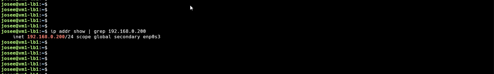

### Failover — VIP migrada a VM2


### Dashboard Grafana — Métricas en tiempo real
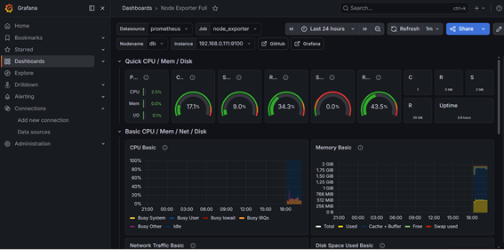

### Fail2ban — IP atacante bloqueada
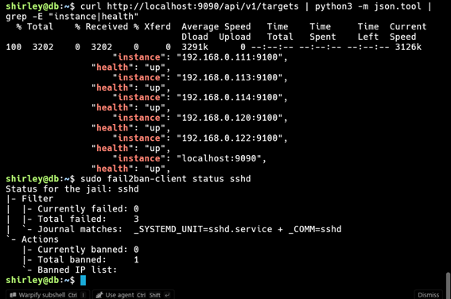

### MariaDB — Usuarios y partidas registradas
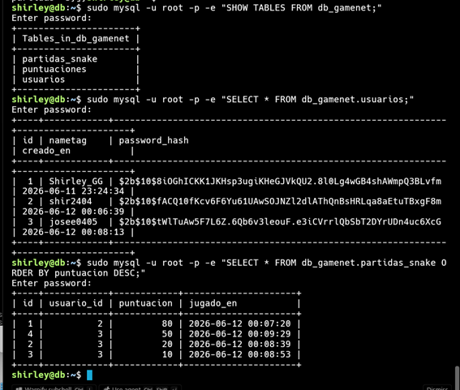

### Página del juego Snake
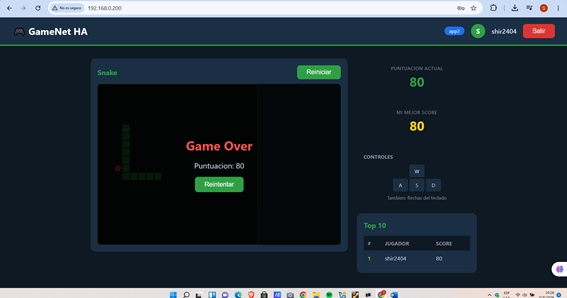
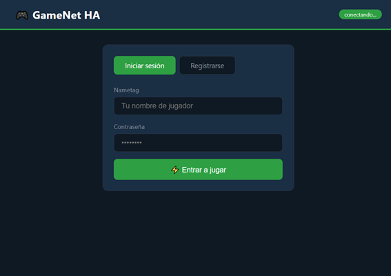
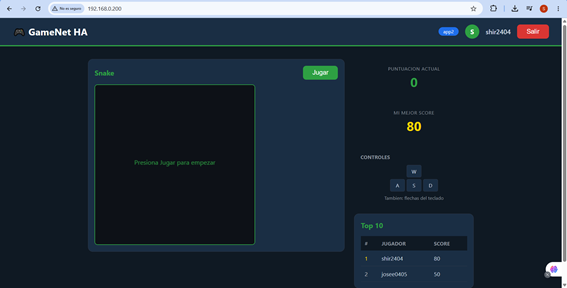

### Backups automáticos y cron configurado
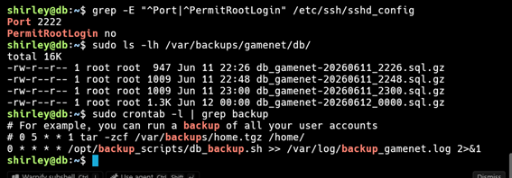

### UFW activo y SSH endurecido
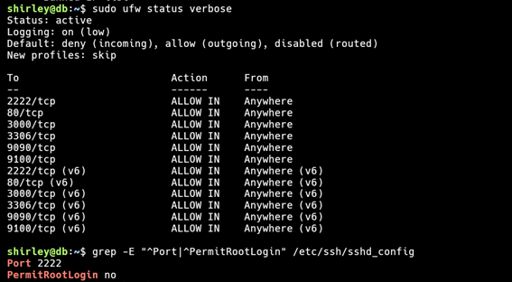

### PM2 online — VM3 app1
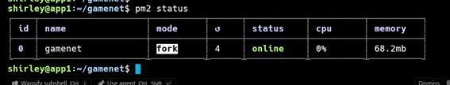

### PM2 online — VM4 app2
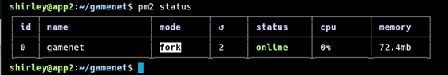

### curl ranking — Flujo completo funcionando
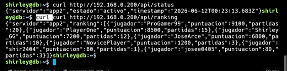

### Prometheus — 5 VMs con health up
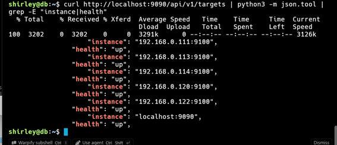

---

## 📚 VIII. Conclusiones y Lecciones Aprendidas

El proyecto GameNet HA demostró exitosamente la implementación de una infraestructura backend de alta disponibilidad para un servidor de juegos multijugador online, integrando 7 de los temas avanzados de la asignatura.

**Logros principales:**
- Se implementó failover automático en menos de 2 segundos mediante Keepalived con unicast, superando el problema del bloqueo de multicast en la red del laboratorio.
- La persistencia de sesión con ip_hash garantiza que los jugadores no pierdan su estado de juego durante el balanceo de carga.
- El sistema de autenticación con bcrypt y JWT proporciona seguridad real comparable a aplicaciones de producción.
- Fail2ban demostró protección activa bloqueando automáticamente ataques de fuerza bruta.
- El RTO de restauración de base de datos fue menor a 5 segundos.

**Desafíos superados:**
- Configuración de Keepalived con unicast en lugar de multicast por restricciones de la red del laboratorio.
- Gestión de IPs dinámicas al cambiar de red, resuelta mediante configuración estática con Netplan.
- Integración de CORS en Node.js para permitir peticiones del juego web al backend.

**Qué mejoraríamos:**
- Implementar replicación de MariaDB para eliminar el punto único de fallo en la capa de datos.
- Agregar certificados TLS/SSL para cifrar el tráfico HTTP.
- Implementar alertas automáticas en Grafana cuando el CPU supere el 80%.
- Dockerizar la aplicación Node.js para facilitar el despliegue.
